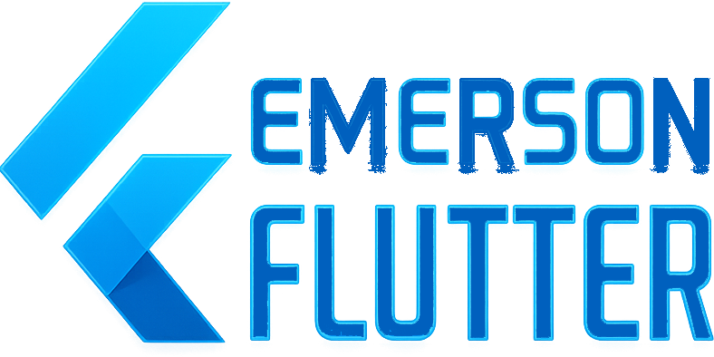

  

This is my curated Flutter portfolio — showcasing apps, packages, and experiments built with passion. Inspired by the awesome-flutter list, but focused on my own journey and contributions. If you enjoy the content 📖, support visibility of the projects by giving 👍 | ⭐ | 👏

  

Emerson’s Flutter Portfolio showcases apps, packages, and experiments designed to be scalable, performant, and user-friendly. Built with clean architecture and modern practices, these projects highlight expertise in mobile, web, and desktop development using Flutter.

  

Demonstrations

## 📚 Índice do Portfólio

- [🚀 Projects](#-projects)
- [🎞️ Animações](#animacoes)
- [🔌 APIs](#-apis)
- [🗄️ Banco de dados](#️-banco-de-dados)
- [🧠 Gerência de estado](#-gerência-de-estado)
- [🎮 Jogos](#-jogos)
- [📐 Layouts](#-layouts)
- [🧩 Lógica](#-lógica)
- [📦 Packages](#-packages)
- [📱 Responsividade](#-responsividade)
- [🧭 Rotas](#-rotas)
- [📡 Sensores](#-sensores)
- [🖥️ Telas Base](#️-telas-base)
- [🎨 Temas](#-temas)
- [🧱 UI](#-ui)

---

### 🚀 Projects

# 📱 Utilitários
- [`agenda_contatos`](Portifolio/Projects/agenda_contatos/)
- [`catalogo_produtos`](Portifolio/Projects/catalogo_produtos/)
- [`produto_app`](Portifolio/Projects/produto_app/)
- [`to_do`](Portifolio/Projects/to_do/)
- [`to_do_list`](Portifolio/Projects/to_do_list/)

# 💼 Business / Dashboards
- [`dashboard_empresarial`](Portifolio/Projects/dashboard_empresarial/)
- [`ecommerce`](Portifolio/Projects/ecommerce/)
- [`Dart_app`](Portifolio/Projects/Dart_app/)

# 🎮 Games & Experimentos
- [`rpg_life`](Portifolio/Projects/rpg_life/)
- [`manju`](Portifolio/Projects/manju/)

# ⚡ Técnicos / Testes
- [`acende_led_nodeMCU`](Portifolio/Projects/acende_led_nodeMCU/)
- [`imc_clone`](Portifolio/Projects/imc_clone/)
- [`super_app`](Portifolio/Projects/super_app/)
- [`technical_test`](Portifolio/Projects/technical_test/)

---

### 🎞️ Animações 

- *(adicione links quando criar subexemplos)*

**Caminho:** [`Portifolio/Animações/`](Portifolio/Animações/)

---

### 🔌 APIs
- [`dio_api`](Portifolio/Apis/dio_api/) — exemplos com **Dio**
- [`http_api`](Portifolio/Apis/http_api/) — exemplos com **http**

**Caminho:** [`Portifolio/Apis/`](Portifolio/Apis/)

---

### 🗄️ Banco de dados
- *(adicione itens como Hive/Isar/SQLite se existirem)*

**Caminho:** [`Portifolio/Banco de dados/`](Portifolio/Banco%20de%20dados/)

---

### 🧠 Gerência de estado
- *(ex.: Bloc/Cubit, Riverpod, Provider…)*

**Caminho:** [`Portifolio/Gerência de estado/`](Portifolio/Gerência%20de%20estado/)

---

### 🎮 Jogos
- [`pong`](Portifolio/Jogos/pong/)

**Caminho:** [`Portifolio/Jogos/`](Portifolio/Jogos/)

---

### 📐 Layouts
- *(grade, constraints, responsive rows/cols…)*

**Caminho:** [`Portifolio/Layouts/`](Portifolio/Layouts/)

---

### 🧩 Lógica
- [`alo_mundo`](Portifolio/Lógica/alo_mundo/)
- [`area_circulo`](Portifolio/Lógica/area_circulo/)
- [`ola_mundo`](Portifolio/Lógica/ola_mundo/)
- [`soma_app`](Portifolio/Lógica/soma_app/)

**Caminho:** [`Portifolio/Lógica/`](Portifolio/Lógica/)

---

### 📦 Packages
- [`design_system`](Portifolio/Packages/design_system/)

**Caminho:** [`Portifolio/Packages/`](Portifolio/Packages/)

---

### 📱 Responsividade
- *(breakpoints, mediaquery, layout builder…)*

**Caminho:** [`Portifolio/Responsividade/`](Portifolio/Responsividade/)

---

### 🧭 Rotas
- *(Navigator 1.0/2.0, go_router, beamer…)*

**Caminho:** [`Portifolio/Rotas/`](Portifolio/Rotas/)

---

### 📡 Sensores
- [`battery/battery`](Portifolio/Sensores/battery/battery/)

**Caminho:** [`Portifolio/Sensores/`](Portifolio/Sensores/)

---

### 🖥️ Telas Base
- [`splash`](Portifolio/Telas%20Base/splash/)
- [`splash_basic`](Portifolio/Telas%20Base/splash_basic/)
- [`splash_degrade`](Portifolio/Telas%20Base/splash_degrade/)

**Caminho:** [`Portifolio/Telas Base/`](Portifolio/Telas%20Base/)

---

### 🎨 Temas
- *(ThemeData, cores, tipografia…)*

**Caminho:** [`Portifolio/Temas/`](Portifolio/Temas/)

---

### 🧱 UI
- [`chat_reactions`](Portifolio/UI/chat_reactions/)
- [`Cupertino`](Portifolio/UI/Cupertino/)
- [`Material`](Portifolio/UI/Material/)

**Caminho:** [`Portifolio/UI/`](Portifolio/UI/)

## 📌 Tecnologias usadas

- Flutter 3.x
- Dart
- Hive, SQLite
- GetIt, Bloc, Provider
- Dio, HTTP, SharedPreferences
- Lottie, Google Fonts

---

## 📫 Contato

📧 emersonpestana.o@gmail.com  
🌐 [GitHub](https://github.com/EmersonPestanaOliveira)

---

> Este repositório é atualizado conforme novos projetos são desenvolvidos.
