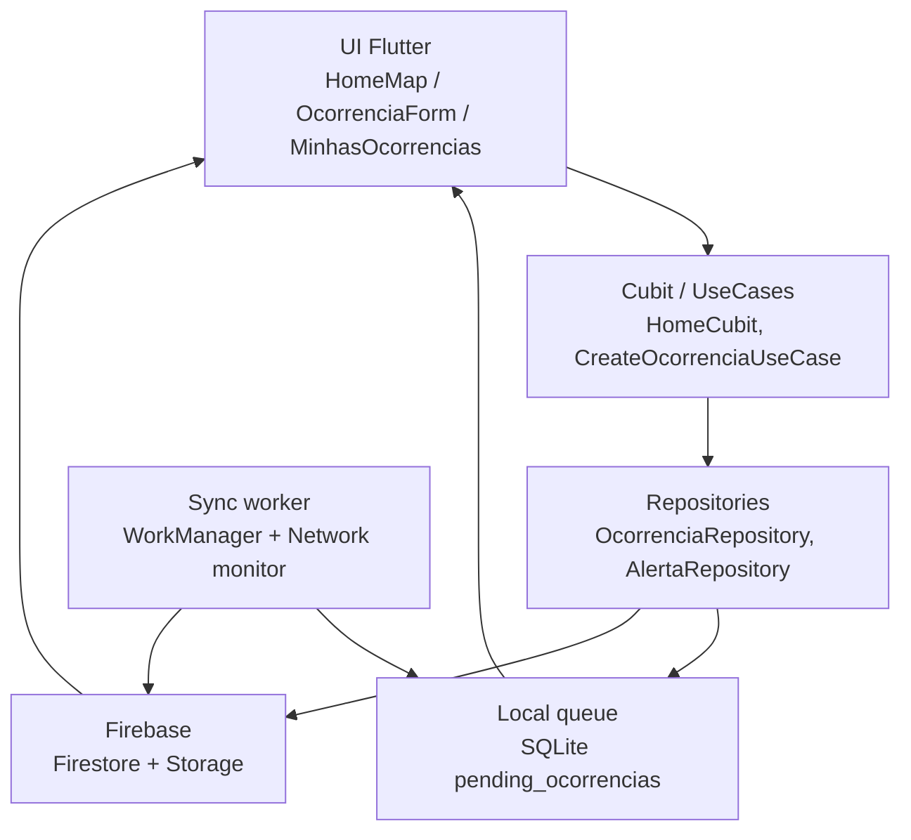
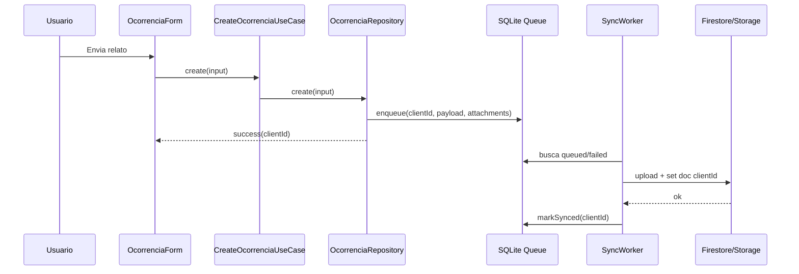

# Arquitetura - Mapa Comunitario e Ocorrencias Offline

## Objetivo

Implementar uma base demonstravel para o case tecnico da Gabriel: mapa com milhares de alertas/ocorrencias, criacao offline-first, filtros, sync resiliente e pontos claros de observabilidade/teste.

## Fluxo De Dados

## Criacao Offline

## Decisoes Tecnicas

| Tema | Escolha | Alternativas | Trade-off |
|---|---|---|---|
| Estado | Cubit + UseCases | Bloc com eventos, Riverpod | Mantem o padrao existente do app e reduz risco na entrevista. |
| Fila offline | SQLite local com tabela `pending_ocorrencias` | Drift, Hive, Isar, Firestore offline puro | Source of truth local explicita, sem geracao de codigo e facil de testar. |
| Idempotencia | `clientId` UUID como ID do doc Firestore | ID gerado pelo servidor | Retry nao duplica ocorrencia. |
| Sync | `WorkManager` + gatilho ao voltar online | Apenas foreground sync | Melhor resiliencia; iOS ainda depende das restricoes do sistema. |
| Mapa | Grid clustering local + cache de bitmap | `google_maps_cluster_manager`, supercluster, tiles vetoriais | Remove conflito com `google_maps_flutter`; supercluster/tiles entram se escala crescer muito. |
| Viewport | `onCameraIdle` + bounds + GeoHash quando disponivel | Buscar todos sempre | Reduz custo e prepara GeoHash/S2 no backend. |

## Como Escalaria

1. Persistir `geohash` ou S2 cell em alertas/ocorrencias no Firestore.
2. Manter `GetAlertasInBoundsUseCase` consultando por viewport; hoje ele tenta `geohash` e cai para fallback se o backend ainda nao tiver o campo/indice.
3. Criar cache local de alertas por viewport e janela temporal.
4. Para areas com mais de 50k pins ativos, trocar clusters client-side por tiles raster/vector pre-renderizados.
5. Adicionar rate limit e moderacao no backend para reduzir abuso.

## Estrategia de Escala do Viewport

O benchmark local em `docs/BENCHMARK_MAP.md` mede o custo combinado do filtro
defensivo do `GetAlertasInBoundsUseCase` e do `AlertaClusterService.build` para
1k, 5k, 10k e 50k pins sinteticos. Em modo test/debug, o filtro por bounds +
tipo + data fica em p95 de ~33 ms com 10k pins carregados, mas sobe para ~146 ms
com 50k pins; por isso, 10k pins no cliente e o limite operacional para manter a
filtragem local como fallback, e 50k e o gatilho claro para tornar a consulta
espacial do servidor obrigatoria.

A primeira migracao e GeoHash no Firestore: cada alerta ganha `geohash`, o
repository consulta ranges que cobrem o viewport e aplica `tipo`/`data` nos
indices compostos. A API publica nao muda: `GetAlertasInBoundsUseCase` continua
recebendo `LatLngBounds`, `zoom` e `AlertaFilter`; a troca fica dentro de
`AlertaRepository.getAlertasInBounds`, mantendo o filtro em memoria apenas como
guarda de corretude contra bordas e indices ausentes.

GeoHash continua adequado enquanto o volume por viewport ainda cabe em poucos
milhares de documentos e a UI precisa de pins interativos. Se areas densas
passarem a retornar dezenas de milhares de documentos mesmo apos o corte por
GeoHash, a evolucao natural e S2 cells com niveis por zoom para reduzir bordas e
balancear celulas. Acima disso, quando o objetivo vira explorar calor/cluster em
macro escala e nao inspecionar cada pin, o backend passa a entregar tiles
vetoriais ou raster pre-renderizados por zoom, e o app alterna para pins
individuais apenas no zoom alto.

## Indices Firestore Necessarios

A consulta da colecao `alertas` por viewport usa `geohash` como campo principal
e pode combinar filtros de `tipo` e `data`. Para evitar fallback pesado, crie os
indices compostos abaixo:

- `geohash ASC`
- `geohash ASC, tipo ASC`
- `geohash ASC, data ASC`
- `geohash ASC, tipo ASC, data ASC`

Quando o Firestore retornar erro de indice ausente (`failed-precondition`), o
app registra `map.viewport_query_fallback` com
`reason=missing_firestore_index`. O fallback existe para manter a UX em bases
pequenas, mas nao deve ser o caminho normal em producao.

## Metricas De Saude

Traces principais:
- `sync_ocorrencias`: total, sucesso, falhas e duracao.
- `home_load_alertas`: quantidade retornada, zoom e area do bounds.
- `map_cluster_build`: quantidade de pins e tempo para gerar markers.
- `ocorrencia_create_local`: tempo ate persistir localmente.
- `ocorrencia_upload_attachment`: tempo e tamanho por arquivo.

Logs importantes:
- `sync.failed` com `clientId`, tentativa e erro.
- `sync.dead_letter` apos limite de tentativas.
- `map.viewport_changed` com zoom e contagem de pins.

## Sync Em Background

No Android, `configureBackgroundOcorrenciaSync` registra uma task periodica do
WorkManager a cada 15 minutos, com `NetworkType.connected`, chamando
`OcorrenciaSyncWorker.syncPendingOcorrencias()` em um isolate que inicializa
Firebase, SQLite/DI e Telemetry. Esse intervalo e o minimo pratico do
WorkManager para tarefas periodicas e preserva bateria melhor do que polling em
foreground.

No iOS, o mesmo plugin depende dos bindings de Background Fetch/BGTaskScheduler.
A execucao e best-effort: o sistema decide a janela conforme bateria, uso do app
e rede. Por isso o app combina background periodico com `OcorrenciaSyncOrchestrator`,
que observa `NetworkConnectionMonitor` fora da UI e dispara sync com debounce
quando a conexao transita para online.

## Estado Atual De Implementacao

- Outbox SQLite possui `next_attempt_at`, `deadLetter` e reset de itens presos em `syncing`.
- `OcorrenciaSyncWorker` processa apenas itens elegiveis pelo horario de retry; o WorkManager registra task periodica de 15 min com rede conectada e um orchestrator dispara sync quando a rede volta.
- Alertas possuem caminho de query por viewport usando `geohash` quando o backend ja disponibiliza o campo, com fallback para filtro local.
- O `HomeCubit` aplica buffer de 50% no viewport antes de consultar (area 2.25x do visivel). Pan/zoom curtos ficam cobertos pelo bounds expandido anterior, sem nova query e sem flicker; eventos `map.viewport_query_skipped` mostram quando o cache cobriu.
- Benchmark de viewport documenta p95 de ~33 ms em 10k pins e ~146 ms em 50k pins para o filtro local, definindo o limite para migrar a consulta espacial ao backend.
- Filtro por raio usa distancia haversine quando centro e raio estao definidos.
- `PinCache` e consultado no caminho de renderizacao dos markers, com telemetria amostrada de hit/miss para `BitmapDescriptor`.
- Telemetry esta encapsulado em `core/observability/telemetry.dart`, com Crashlytics e Firebase Performance atras de API mockavel.
- Testes criticos cobrem sync success/failure/dead-letter/stale syncing, recovery online com debounce, filtro por raio, benchmark de viewport, cache de pins, bucket de cluster e buffer de viewport (cobertura, pan curto, pan grande, troca de filtro).

## Buffer De Viewport

O carregamento de pins usa `_viewportBufferRatio = 0.5` em `HomeCubit._fetchInBounds`. Antes de chamar o `GetAlertasInBoundsUseCase`, o bounds visivel e expandido em 50% em cada eixo (latitude e longitude), resultando em uma area pre-carregada 2.25x maior que a visivel. O cache check passa de "bounds quase iguais" para "viewport visivel contido no bounds expandido anterior" (containment estrito com epsilon de `1e-6` para precisao de ponto flutuante), o que elimina o caso patologico onde qualquer pan minusculo invalidava o cache e refazia query.

Trade-off: cada query retorna mais documentos (~2.25x), o que aumenta levemente o custo de Firestore reads e o tempo de download. Em compensacao, o numero de queries cai porque pan/zoom dentro do buffer reutiliza o resultado anterior. O ganho liquido e maior em redes lentas (menos round-trips) e em uso intensivo de pan (menos queries). Para volumes muito altos, o buffer pode ser reduzido (ex.: 0.25 = anel de 25%) para limitar a leitura por query.

## Acumulador De Pins Remotos

`HomeCubit` mantem um `Map<String, Alerta> _accumulatedRemote` (chave = `mergeKey`) que acumula todos os pins remotos vistos durante a sessao. A regra:

- `loadData` popula o acumulador com a resposta inicial e marca `_lastFilter = AlertaFilter()`.
- `_fetchInBounds`, ao receber pins novos, **adiciona/atualiza** entradas em vez de substituir; o que estava la antes continua la.
- `_fetchInBounds` so esvazia o acumulador quando detecta `_lastFilter != currentState.filter` antes de aplicar o resultado novo, garantindo que mudanca de filtro produz uma lista limpa.
- A UI le `_accumulatedRemote.values` via `_mergePins`, que acrescenta os pins locais (`PendingOcorrencias` + recem sincronizados) e devolve o `AlertaPinMergeResult` final.

Sem o acumulador, todo `onCameraIdle` cujo viewport-fetch retorna um subconjunto dos pins do `loadData` derrubaria os pins antigos do estado — exatamente o sintoma de "pins sumindo durante o pan" que motivou esta evolucao. Com o acumulador, o estado e a uniao monotonica dos viewports visitados ate o filtro mudar.

Limites: como o repositorio cap a `getAlertas()` em 2000 docs e cada `getAlertasInBounds` em ~2000 (4 ranges × 500), o acumulador cresce no maximo na faixa de poucos milhares de entradas para um usuario tipico. Em cenarios de altissima densidade, o passo de evolucao natural e: prune por distancia ao centro do viewport corrente (ex.: descartar entradas alem de 3x o expandido) ou cap LRU duro. A telemetria `map.viewport_loaded` ja expoe `accumulatedRemoteSize` e `newPinsAdded` para detectar a hora de adicionar prune.

Alertas sugeridos:
- Taxa de sync < 95% em 1 hora.
- P95 time-to-sync > 30 minutos.
- Outbox depth p95 acima de 10 itens por usuario.
- Crash-free users < 99,5% no release.

## Pontos Para Defender Na Entrevista

- A UI nunca precisa esperar a rede para confirmar o relato.
- O `clientId` resolve idempotencia de forma simples e robusta.
- O mapa nao deve buscar todos os pins; ele reage a viewport e zoom, usando GeoHash quando o backend suporta.
- Grid clustering e cache de `BitmapDescriptor` atacam o gargalo real do Google Maps.
- O MVP e simples, mas tem caminhos claros para GeoHash, S2 e tiles.
