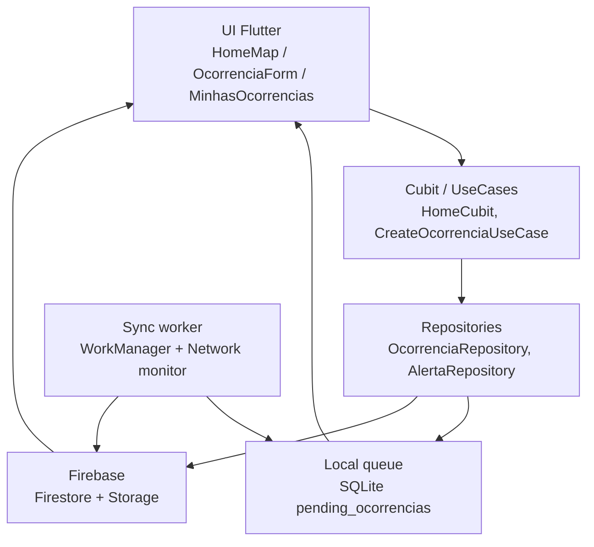
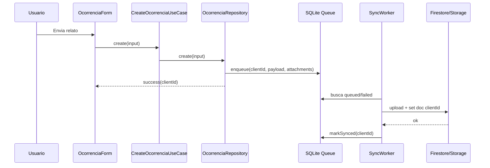

# Arquitetura - Mapa Comunitario e Ocorrencias Offline

## Objetivo

Implementar uma base demonstravel para o case tecnico da Gabriel: mapa com milhares de alertas/ocorrencias, criacao offline-first, filtros, sync resiliente e pontos claros de observabilidade/teste.

## Fluxo De Dados

## Criacao Offline

## Decisoes Tecnicas

| Tema | Escolha | Alternativas | Trade-off |
|---|---|---|---|
| Estado | Cubit + UseCases | Bloc com eventos, Riverpod | Mantem o padrao existente do app e reduz risco na entrevista. |
| Fila offline | SQLite local com tabela `pending_ocorrencias` | Drift, Hive, Isar, Firestore offline puro | Source of truth local explicita, sem geracao de codigo e facil de testar. |
| Idempotencia | `clientId` UUID como ID do doc Firestore | ID gerado pelo servidor | Retry nao duplica ocorrencia. |
| Sync | `WorkManager` + gatilho ao voltar online | Apenas foreground sync | Melhor resiliencia; iOS ainda depende das restricoes do sistema. |
| Mapa | Grid clustering local + cache de bitmap | `google_maps_cluster_manager`, supercluster, tiles vetoriais | Remove conflito com `google_maps_flutter`; supercluster/tiles entram se escala crescer muito. |
| Viewport | `onCameraIdle` + bounds + GeoHash quando disponivel | Buscar todos sempre | Reduz custo e prepara GeoHash/S2 no backend. |

## Como Escalaria

1. Persistir `geohash` ou S2 cell em alertas/ocorrencias no Firestore.
2. Manter `GetAlertasInBoundsUseCase` consultando por viewport; hoje ele tenta `geohash` e cai para fallback se o backend ainda nao tiver o campo/indice.
3. Criar cache local de alertas por viewport e janela temporal.
4. Para areas com mais de 50k pins ativos, trocar clusters client-side por tiles raster/vector pre-renderizados.
5. Adicionar rate limit e moderacao no backend para reduzir abuso.

## Metricas De Saude

Traces principais:
- `sync_ocorrencias`: total, sucesso, falhas e duracao.
- `home_load_alertas`: quantidade retornada, zoom e area do bounds.
- `map_cluster_build`: quantidade de pins e tempo para gerar markers.
- `ocorrencia_create_local`: tempo ate persistir localmente.
- `ocorrencia_upload_attachment`: tempo e tamanho por arquivo.

Logs importantes:
- `sync.failed` com `clientId`, tentativa e erro.
- `sync.dead_letter` apos limite de tentativas.
- `map.viewport_changed` com zoom e contagem de pins.

## Estado Atual De Implementacao

- Outbox SQLite possui `next_attempt_at`, `deadLetter` e reset de itens presos em `syncing`.
- `OcorrenciaSyncWorker` nao segura WorkManager com delay; ele processa apenas itens elegiveis pelo horario de retry.
- Alertas possuem caminho de query por viewport usando `geohash` quando o backend ja disponibiliza o campo, com fallback para filtro local.
- Filtro por raio usa distancia haversine quando centro e raio estao definidos.
- Telemetry esta encapsulado em `core/observability/telemetry.dart`, com Crashlytics e Firebase Performance atras de API mockavel.
- Testes criticos cobrem sync success/failure/dead-letter/stale syncing, filtro por raio e bucket de cluster.

Alertas sugeridos:
- Taxa de sync < 95% em 1 hora.
- P95 time-to-sync > 30 minutos.
- Outbox depth p95 acima de 10 itens por usuario.
- Crash-free users < 99,5% no release.

## Pontos Para Defender Na Entrevista

- A UI nunca precisa esperar a rede para confirmar o relato.
- O `clientId` resolve idempotencia de forma simples e robusta.
- O mapa nao deve buscar todos os pins; ele reage a viewport e zoom, usando GeoHash quando o backend suporta.
- Grid clustering e cache de `BitmapDescriptor` atacam o gargalo real do Google Maps.
- O MVP e simples, mas tem caminhos claros para GeoHash, S2 e tiles.
